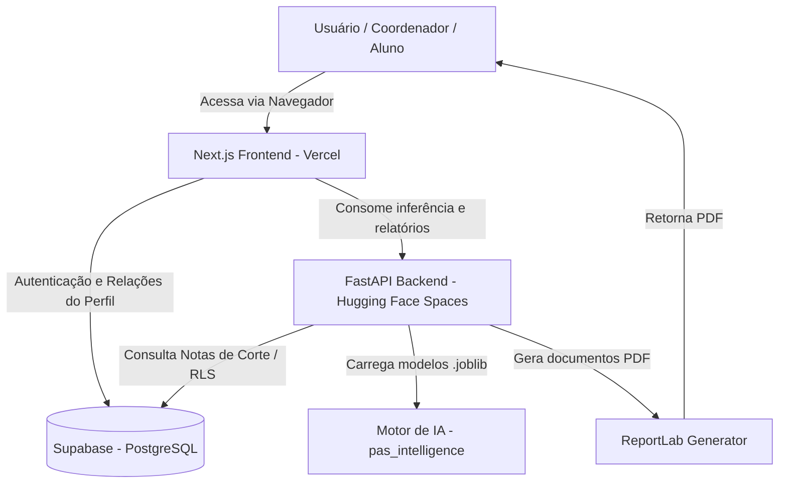

# 📘 Developer & Agent Handbook: Vetor PAS

Este documento serve como o manual definitivo do sistema **Vetor PAS**. Ele foi projetado para dar a qualquer desenvolvedor ou agente de Inteligência Artificial um entendimento completo e profundo de todo o contexto técnico, de negócios e arquitetural do projeto.

---

## 1. Visão Geral do Produto e Modelo de Negócio

O **Vetor PAS** é uma plataforma de inteligência pedagógica B2B/B2C focada em prever o desempenho e calcular probabilidades de aprovação de estudantes no **PAS/UnB** (Programa de Avaliação Seriada da Universidade de Brasília). 

### O Problema
O PAS é um vestibular seriado em três etapas (PAS 1, PAS 2 e PAS 3) com um edital de cálculo de notas extremamente complexo e confuso (envolvendo notas padronizadas baseadas nas médias e desvios padrão de cada ano). Isso gera grande ansiedade nos alunos sobre quanto eles precisam tirar na última etapa para passar.

### A Solução
O Vetor PAS resolve essa dor usando modelos de Machine Learning (treinados em dados históricos reais de mais de 48 mil candidatos) para:
1.  **Predição de Desempenho:** Prever qual será a nota final do aluno no PAS 3 baseado nas notas que ele tirou no PAS 1 e 2.
2.  **Quanto Falta (Engenharia Reversa):** Calcular exatamente qual a nota mínima (Escore Bruto) que o aluno precisa tirar no PAS 3 para alcançar a nota de corte do curso desejado.
3.  **Gestão Pedagógica B2B:** Permitir que escolas parceiras façam o upload de turmas inteiras e visualizem o risco dos alunos através de um **Semáforo de Risco** (Verde = Baixo Risco, Amarelo = Médio Risco, Vermelho = Alto Risco).

### 📢 Construindo em Público (Build in Public)
O Vetor PAS está sendo desenvolvido sob a filosofia **Build in Public**. Isso significa que:
- O progresso do desenvolvimento, ideias de design, validações e desafios técnicos são compartilhados abertamente com a comunidade.
- A **Landing Page Temporária** com o formulário de lista de espera (waitlist) foi colocada em produção na `main` desde cedo para validar o interesse e coletar leads qualificados organicamente enquanto o MVP principal (na branch `feat/nextjs-frontend`) é construído.

---

## 2. Estratégia de Branches e Landing Pages

O ecossistema de branches do Git é dividido estrategicamente para gerenciar o pré-lançamento e o MVP:

1.  **`main` (Página de Espera - PRODUÇÃO)**:
    *   **Propósito**: Contém o site de pré-lançamento do projeto com o formulário de lista de espera (waitlist) e a história do fundador.
    *   **Status**: **100% Implementado e Implantado**. É a branch de produção oficial conectada à Vercel. Qualquer alteração aqui é implantada automaticamente na URL pública ([vetorpas.com.br](https://vetorpas.com.br)).
2.  **`feat/nextjs-frontend` (Painel e Landing Page Principal - DESENVOLVIMENTO)**:
    *   **Propósito**: Contém a landing page principal definitiva e a interface completa de dashboards do portal do aluno e da escola.
    *   **Status**: **Em desenvolvimento constante (Local)**. Esta branch ainda não foi mergeada para a `main`, portanto suas páginas não estão acessíveis em produção.
3.  **`feat/grill`**:
    *   **Propósito**: Branch secundária de testes e experimentações.

---

## 3. Arquitetura do Sistema e Status de Deploy

O sistema opera de forma desacoplada em três camadas. Abaixo está a especificação técnica e o status de deploy de cada uma:



### Camadas Tecnológicas e Status

1.  **Frontend (Diretório `landing-page/`)**:
    *   **Tecnologia**: **Next.js (App Router)** com React, TypeScript e TailwindCSS (v4).
    *   **Status de Deploy**: **Ativo em Produção na Vercel**. A branch `main` serve a Landing Page Temporária de espera. A branch `feat/nextjs-frontend` (portal completo) é executada apenas localmente (`http://localhost:3000`) por enquanto.
2.  **Backend API (Diretório `api/`)**:
    *   **Tecnologia**: **FastAPI** (Python).
    *   **Status de Deploy**: **Apenas Local (localhost:8000)**. A hospedagem no **Hugging Face Spaces** (via Docker) está planejada e decidida na arquitetura (ADR 0004), mas ainda não foi ativada em produção. A URL de produção da Vercel precisará apontar para o link do Space através da variável `API_URL` assim que o deploy for feito.
3.  **BaaS / Banco de Dados / Auth**:
    *   **Tecnologia**: **Supabase** (PostgreSQL).
    *   **Status de Deploy**: **Ativo e Conectado em Produção**. O banco de dados e o provedor de autenticação estão funcionando tanto localmente quanto na URL de produção.
4.  **Processador Analítico (Core - `src/pas_intelligence/` e `src/pdf_generator.py`)**:
    *   **Tecnologia**: Modelos serializados `.joblib` em Python executados com Scikit-Learn/LightGBM e geração de PDFs com ReportLab.
    *   **Status de Deploy**: **100% Implementado**. Integrado à API local do FastAPI. O deploy final em produção ocorrerá junto com a API do FastAPI no Hugging Face Spaces.
5.  **Dashboard Legado/Admin (`app/streamlit_app.py`)**:
    *   **Tecnologia**: **Streamlit** (Python).
    *   **Status de Deploy**: **Apenas Local**. Utilizado internamente para administração e testes rápidos de novas lógicas.


---

## 4. Estrutura de Diretórios e Código

A raiz do monorepo é estruturada da seguinte forma:

```
├── .streamlit/             # Configurações de tema e segredos do Streamlit
├── api/                    # Código do backend FastAPI
│   ├── main.py             # Entrada principal, CORS e inicialização do FastAPI
│   ├── routers/            # Endpoints REST (predict.py, analytics.py, gestao.py)
│   ├── schemas/            # Schemas de validação de dados Pydantic
│   └── services/           # Lógica que encapsula a chamada ao motor preditivo
├── app/
│   └── streamlit_app.py    # Dashboard Streamlit (legado/admin interno)
├── assets/
│   └── templates/          # Logotipos de escolas e templates de PDFs Whitelabel
├── docs/                   # Documentação detalhada em Markdown
│   ├── adr/                # Architectural Decision Records (ADRs 0001 a 0007)
│   ├── modules/            # Detalhamento de cada módulo do sistema
│   ├── architecture.md     # Visão geral da stack
│   ├── identidade-visual.md# Design tokens da UnB (HEX, Tailwind, config)
│   └── requirements.md     # Requisitos Funcionais e Não-Funcionais
├── landing-page/           # Frontend Next.js
│   ├── app/                # Rotas da aplicação (App Router)
│   │   ├── (public)/       # Rotas públicas (/predict, /temporal, landing page)
│   │   ├── auth/           # Login e cadastro do Supabase
│   │   └── (dashboard)/    # Rotas privadas /app/* (gestao, relatorios, escola)
│   ├── components/         # Componentes React (UI, brand, dashboard)
│   ├── lib/                # Utilitários, chamadas Supabase e tipos
│   └── README.md           # Guia de setup do frontend
├── models/                 # Pacote de modelo do PAS 3 (pas3/) e artefatos aposentados - Gitignored
├── scripts/                # Scripts utilitários de importação de dados e mocks
├── src/                    # Código core do backend em Python
│   ├── pas_intelligence/   # O "cérebro" de Inteligência Artificial do sistema
│   ├── data_processing/    # Limpeza e preparação de dados
│   ├── extract_pas1_pdf.py # Parsers para ler PDFs de resultados do Cebraspe
│   ├── extract_pas2_html.py# Parsers para extrair notas de páginas HTML
│   └── pdf_generator.py    # Gerador de relatórios ReportLab PDF
├── tests/                  # Testes unitários do backend (Pytest)
├── CONTEXT.md              # Linguagem ubíqua e conceitos de produto
├── README.md               # Instruções gerais de inicialização do projeto
└── requirements.txt        # Dependências de bibliotecas Python
```

---

## 5. Regras de Negócio e Cálculos (O Edital Cebraspe)

As notas no PAS/UnB não são somas simples. O Cebraspe calcula a nota em relação à média e ao desvio padrão de cada prova no ano respectivo.

*   **Escore Bruto (EB):**
    O Escore Bruto de uma etapa é a soma ponderada das questões objetivas (dividida entre Parte 1 e Parte 2).
*   **Nota Padronizada (NP):**
    Calculada como:
    $$NP = 10 \times \frac{EB - \mu}{\sigma} + 50$$
    Onde $\mu$ é a média oficial e $\sigma$ é o desvio padrão da etapa naquele ano específico.
*   **Argumento Final (AF):**
    O Argumento Final é a pontuação acumulada ponderada das três etapas:
    $$AF = NP_1 \times 0.72 + NP_2 \times 8.28 + NP_3 \times 1.00$$
    *Nota: A redação das etapas 1 e 2 não tem peso direto, mas a redação do PAS 3 possui um cálculo integrado ao edital.*
*   **Engenharia Reversa ("Quanto Falta"):**
    O módulo `target_calculator.py` recebe a nota de corte alvo (Argumento Final) e os EBs conhecidos do aluno no PAS 1 e PAS 2. Ele resolve a equação reversamente para encontrar o $EB_3$ necessário. Como as médias e desvios oficiais do PAS 3 ainda não foram divulgados, o sistema projeta esses dados usando regressão linear histórica antes de calcular o alvo.

---

## 6. O Motor de IA (`src/pas_intelligence/`)

O coração preditivo do Vetor PAS é **um modelo só, mais aritmética**. Até o ticket 13 eram oito
artefatos `.joblib` orquestrados por um ensemble dinâmico; a medição que os aposentou está no
ADR-0011 e no ADR-0009.

### A cadeia (ADR-0009 — Alvo Canônico)

```
Â3                     ← a ÚNICA previsão do modelo (Argumento da Etapa 3)
A1, A2                 ← aritmética exata sobre as notas que o Aluno já tem na mão
Argumento Final        = A1 + 2·A2 + 3·Â3
σ(Argumento Final)     = 3 × σ(A3)          — exato: A1 e A2 têm variância zero
```

Para quem já fez PAS 1 e PAS 2, `A1` e `A2` **não são previsão**: as notas estão na mão e as
médias/desvios oficiais daqueles anos são públicos. Prever o Argumento Final inteiro gastava
capacidade estatística reaprendendo, de forma aproximada, ⅗ do peso de uma conta já exata — e
produzia um número que podia contradizer as notas que o próprio Aluno digitou.

### O pacote de modelo (`models/pas3/`, servido por `model_package.py`)

| Arquivo | O que é |
|---|---|
| `modelo_pas3.txt` | LightGBM em texto nativo (`n_estimators=400, learning_rate=0,01, num_leaves=15`) |
| `manifest.json` | Proveniência (hash do CSV, commit, versões), features, métricas e a Largura de Incerteza |

**Vetor de features canônico (11), na ordem — a ordem é contrato:**
`[a1, a2, EB_PAS1, Red_PAS1, EB_PAS2, Red_PAS2, Cresc_EB, Cresc_Red, cresc_eb_pct,
cresc_red_pct, sinal_cresc_eb]`. Sem scaler. Passar o vetor trocado não levanta erro — devolve
número errado, que foi o que invalidou o ADR-0007. `PacoteDeModelo.carregar` recusa um pacote
cuja ordem não bata com a canônica.

**Aluno sem Etapa 1** (as três notas da Etapa 1 iguais a zero): as oito colunas derivadas da
Etapa 1 viram **`NaN` nativo**, não zero literal, e a Largura de Incerteza é a da classe dele.
A detecção acontece em runtime, e o formulário tem um botão *"Não fiz o PAS 1"* — sem ela o
modelo leria "fez a prova e tirou zero" e erraria a **previsão**, não só a largura.

### A Largura de Incerteza

`P(X > Nota de Corte)` com `X ~ N(Argumento previsto, largura²)`. A largura vem do
`manifest.json`, **um número por classe de Aluno**, medido fora-da-dobra. Antes era a constante
`13,49` em `statistics.py` e `gestao_service.py` — resíduo de um modelo aposentado, que ficava
errado por construção a cada troca de modelo sem que nada avisasse (ADR-0012). Hoje
`calculate_approval_probability` **exige** o parâmetro: não há valor padrão para esquecer.

### Quando a API não responde

`A1` e `A2` dependem da média e do desvio que o Cebraspe publica no Edital de cada Etapa. Para o
triênio vivo (2024-2026) faltam `(2024, Etapa 1)` e `(2025, Etapa 2)`, e enquanto faltarem a API
devolve `modelo_disponivel: False` com o motivo — nunca uma aproximação silenciosa, porque `A1` e
`A2` são a parte *exata* da conta. Na Gestão de Ativos o Aluno aparece como `grey` / *Sem
previsão*, que é diferente de *Alto Risco*.

---

## 7. Emissão de Relatórios Whitelabel (`src/pdf_generator.py`)

A entrega de valor tangível para as Escolas Parceiras é o Relatório Pedagógico Whitelabel individualizado em PDF.
*   O motor utiliza a biblioteca **ReportLab** em Python.
*   Ele renderiza vetores e textos sobre templates em formato PDF localizados na pasta `assets/templates/`.
*   O sistema substitui dinamicamente as paletas de cores do documento e injeta o logo correspondente à escola baseando-se nas configurações do `tenant` associadas ao coordenador requisitante.
*   Suporta **geração em lote**: processa uma turma inteira de alunos na memória, comprime os PDFs em um único arquivo `.zip` e entrega o link para download.

---

## 8. Banco de Dados (Supabase)

O Supabase gerencia a consistência de persistência do ecossistema:
*   `waitlist` — Tabela temporária para registrar leads interessados na lista de espera. Contém: `nome`, `email`, `escola`, `curso_pretendido`.
*   `profiles` — Tabela estendida do Supabase Auth contendo informações adicionais do usuário (`nome`, `escola_id`, `role` [aluno/coordenador]).
*   `tenants` — Tabela que gerencia as Escolas Parceiras ativas. Mapeia a ID da escola para os caminhos de marca (caminho_logo, paleta_cores).

---

## 9. Como Executar e Testar Localmente

### 1. Backend FastAPI (`api/`)
```bash
# Com o ambiente virtual Python ativo (.venv)
pip install -r requirements.txt
uvicorn api.main:app --reload --port 8000
```
Swagger UI disponível em `http://localhost:8000/docs`.

### 2. Frontend Next.js (`landing-page/`)
```bash
cd landing-page
npm install
# Crie e preencha o arquivo .env.local
npm run dev
```
Interface disponível em `http://localhost:3000`.

### 3. Dashboard Streamlit (`app/`)
```bash
# Na raiz do projeto com o .venv ativo
streamlit run app/streamlit_app.py
```

### 4. Executar Testes
```bash
pytest tests/
```

### 5. Regerar os modelos do PAS 3 (ticket 12 — pipeline reprodutível)

`scripts/treinar_pipeline.py` é o único comando que vai do `resultado_final.csv` ao pacote do
modelo (`.scratch/treino-modelos-pas3/` documenta as decisões que ele codifica):

```bash
.venv/bin/python scripts/treinar_pipeline.py data/saida-nova/resultado_final.csv \
    --saida .scratch/treino-modelos-pas3/pacotes/pas3-$(date +%Y-%m-%d)
```

Falha (código de saída ≠ 0) se o modelo treinado não bater o Portão 1 do ticket 07 — nesse caso
não escreve nada em `--saida`. `--forcar "motivo"` publica mesmo assim, gravando o motivo no
`manifest.json`.

O comando **não** promove. Promover é copiar `modelo_pas3.txt` e `manifest.json` do pacote para
`models/pas3/`, preservando o anterior ao lado para poder reverter — é o que o ticket 13 fez em
2026-07-28, com o pacote que a API carrega hoje. O triênio lacrado (2023/2025) nunca entra no
treino do artefato; ele foi lido uma única vez, por `scripts/lacre_ticket13.py`.
