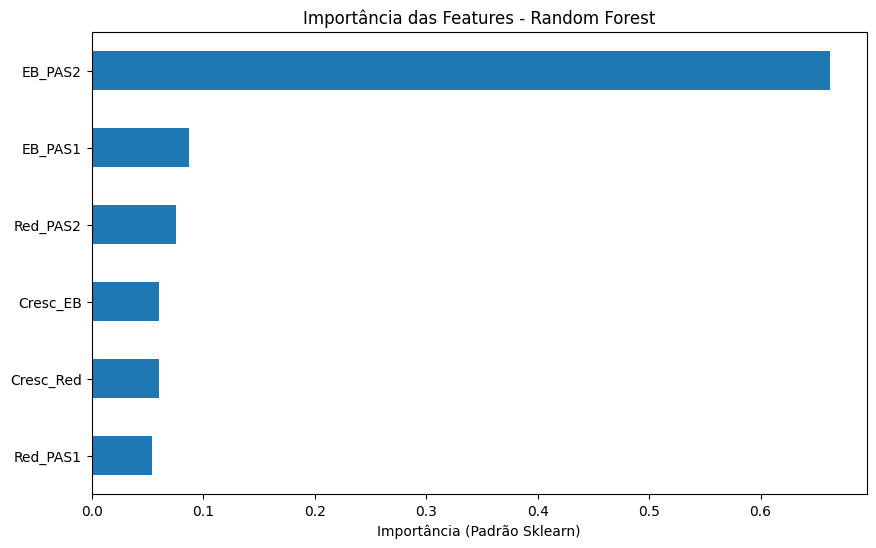
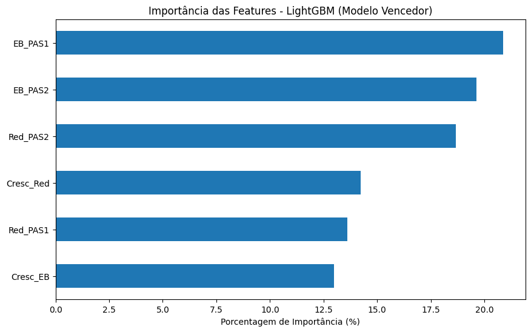

### **Análise Preditiva de Desempenho no PAS (UnB)**

### **Pesquisador**: Luiz Henrique Tomaz Moreira

### **Status**: Fase 1 (Backtest Temporal) Concluída.

### 1. Resumo Executivo

Este projeto é uma análise quantitativa de 7 triênios de dados (2016-2024) do Programa de Avaliação Seriada (PAS) da Universidade de Brasília, compreendendo um dataset mestre de 48.758 alunos.

O objetivo é construir e validar (fazer o backtest) um pipeline de machine learning para prever o desempenho futuro de um aluno (`Escore_Bruto_PAS_3`) com base em seu histórico de desempenho (`PAS_1` e `PAS_2`).

**Principais Descobertas (Fase 1)**

**1. Sinal Preditivo Forte**: O desempenho futuro (`Escore_Bruto_PAS_3`) é altamente previsível. O modelo campeão (`LightGBM`) alcançou um R² (R-Quadrado) de 0.6445 e um MAE (Erro Absoluto Médio) de 6.81 pontos em um dataset de teste cego de 9.752 amostras.

**2. Validação da Hipótese H2**: A "dependência temporal" (histórico) é real. A análise de feature importance do modelo vencedor prova que `EB_PAS1` (20.9%) e `EB_PAS2` (19.6%) são os preditores mais significativos.

**3. Comparação de Modelos**: Modelos de Gradient Boosting (`LGBM`) e Redes Neurais (`MLP`) superaram significativamente os baselines de `RandomForest` e `LinearRegression` em métricas de acurácia (R²) e erro (MAE).

### 2. Hipóteses da Pesquisa

Este projeto foi desenhado para testar as seguintes hipóteses:

• **[H1] A Hipótese da "Análise Objetiva"**: Focar apenas nas métricas de desempenho internas (notas), ignorando (nesta fase) fatores externos como tipo de escola ou dados socioeconômicos.

• **[H2] A Hipótese da "Dependência Temporal"**: Provar que o desempenho não é aleatório e que existe uma autocorrelação onde o desempenho no `PAS_1` e `PAS_2` influencia o `PAS_3`. (Foco da Fase 1 - PROVADA)

• **[H3] A Hipótesse do "Enriquecimento de Habilidade"**: (Próxima Etapa) O poder do modelo aumentará se for enriquecido com proxies de habilidade (Exatas vs. Humanas) de datasets externos (Vestibular tradicional/ENEM).

• **[H4] A Hipótese do "Fator Socioeconômico"**: (Próxima Etapa) O proxy de "escola pública" (derivado das colunas de cotas) tem poder preditivo.

### 3. Metodologia (O Pipeline)

O projeto foi dividido em dois notebooks que representam o pipeline de ponta a ponta:

**Fase 1.A: Engenharia de Dados (O Parser)**

(Veja `/notebooks/01_Parser_PAS.ipynb`)

Foi construído um parser (limpador) robusto em Python (`pdfplumber` + `re`) para extrair e estruturar 7 anos de relatórios em PDF do Cebraspe.

Este parser foi projetado para lidar com dados “sujos” do mundo real, implementando as seguintes lógicas:

• **Processamento de “MegaString”**:
O texto de todas as páginas é juntado (`.join()`) antes do processamento, para “consertar” dados de alunos que “vazavam” por múltiplas linhas.

• **Separador Customizado**:
O split (`.split(' / ')`) é feito usando o caractere `/` como delimitador de aluno (e não a “nova linha”), pois esta se mostrou inconsistente.

• **“Âncora” Robusta (Não-Mágica)**:
O parser não usa índices de linha “mágicos” (ex: `[30:]`).
Em vez disso, ele procura por âncoras de texto (como `ADMINISTRAÇÃO (BACHARELADO)` ou `1.1.1.1`) para encontrar o início dos dados, tornando-o robusto a cabeçalhos de tamanho variável (de 31 a 7097 linhas).

• **“Padding” de Dados Irregulares**:
Foi implementada uma lógica de “acolchoamento” para forçar todas as linhas de aluno a terem o mesmo comprimento (`max_cols`), tratando datasets irregulares antes de criar o DataFrame do Pandas.

**Resultado**: Um `DataFrame` 100% limpo, com 48.758 alunos (`/data/PAS_MESTRE_LIMPO_FINAL.csv`).

**Fase 1.B: EDA e Modelagem (O Backtest)**

(Veja `/notebooks/02_EDA_e_Modelagem_FINAL.ipynb`)

Com o dataset mestre pronto, o pipeline de modelagem foi executado.

• **Análise de Correlação (Heatmap)**: A análise em 48.758 alunos revelou que a correlação entre `EB_PAS2` (passado) e `EB_PAS3` (futuro) é de 0.77, um sinal forte.

• **Engenharia de Atributos (H2)**: Features de "Escore Bruto" (`EB_PAS...`) e "Crescimento" (`Cresc_EB, Cresc_Red`) foram criadas para testar a H2.

• **Pré-processamento**: O dataset foi dividido (80/20) e um `StandardScaler` (padronização Z-score) foi aplicado para preparar os dados para modelos sensíveis à escala (Linear/MLP).

• **Modelagem (O "Campeonato")**: Um "campeonato" de 4 modelos (`LinearRegression`, `RandomForest`, `LightGBM`, `MLPRegressor`) foi executado para encontrar o preditor mais acurado.

### 4. Resultados da Modelagem (Fase 1)

O modelo foi treinado para prever o `EB_PAS3` (Escore Bruto do PAS 3).

### Placar de Acurácia (no dataset de 9.752 testes "cegos")

| Modelo                | R² (Poder de Explicação) | MAE (Erro Médio em Pontos) |
|------------------------|--------------------------|-----------------------------|
| **LightGBM (Vencedor)** | **0.6445**               | **6.8123**                  |
| Rede Neural (MLP)      | 0.6393                   | 6.8423                      |
| Regressão Linear       | 0.6302                   | 6.9371                      |
| Random Forest          | 0.6225                   | 6.9965                      |

O modelo de Gradient Boosting (`LightGBM`) se provou o campeão, explicando 64,45% da variância. Um `R²` de 64,45% (e um `MAE` de 6.81 pontos) é um resultado excelente e robusto para dados de comportamento humano.

**Importância de Atributos (Feature Importance)**

#### Diagnóstico 1: Random Forest (R² = 0.6225)

O RandomForest (RF) adotou uma estratégia "gananciosa", superestimando massivamente a feature **EB_PAS2** (responsável por 66.2% da importância).  
Esta estratégia de "apostar tudo" em um preditor provou ser inferior na média.

#### Diagnóstico 2: LightGBM (R² = 0.6445)

O LightGBM (o vencedor) usou uma estratégia de "time" equilibrada.  
Ele aprendeu (corretamente) que, para a melhor previsão, um conjunto de features é necessário.  
**EB_PAS1 (20.9%)**, **EB_PAS2 (19.6%)** e **Red_PAS2 (18.7%)** foram todas consideradas cruciais, validando a complexidade da **Hipótese H2**.

### 5. Próximas Etapas (Fases 2 e 3)

O trabalho de Fase 1 está completo. As próximas etapas focarão nas hipóteses de enriquecimento de dados.

**Fase 2 (H3)**: Iniciar o pipeline de merge (cruzamento) com datasets externos (Vestibular tradicional/ENEM) para testar o poder preditivo de "Exatas" vs. "Humanas".

**Fase 3 (H4)**: Implementar o parser das colunas de cotas para testar o poder preditivo do fator socioeconômico.

### 6. Como Reproduzir este Projeto

**1.** Clone este repositório.

**2.** Instale as bibliotecas (`pip install pandas pdfplumber scikit-learn lightgbm`).

**3. Parser**: O `notebooks/01_Parser_PAS.ipynb` requer os PDFs originais do Cebraspe para ser executado.

**4. Modelagem**: O `notebooks/02_EDA_e_Modelagem_FINAL.ipynb` pode ser rodado diretamente. Ele carrega o dataset mestre `data/PAS_MESTRE_LIMPO_FINAL.csv` (incluído neste repositório) e reproduz toda a análise.