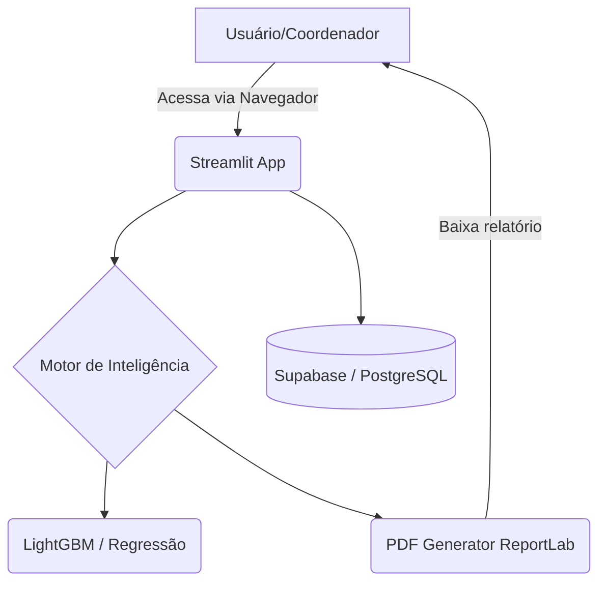

# Arquitetura e Stack Tecnológica

O **Vetor PAS** foi arquitetado com base em um conjunto de tecnologias modernas que oferecem robustez, alta escalabilidade e flexibilidade para o cliente final.

## Diagrama da Arquitetura

## Tecnologias Core

- **Streamlit**: Responsável por toda a camada de *Frontend*. Ideal para prototipagem rápida e iteração contínua junto às escolas.
- **Python 3.10+**: Linguagem principal do *Backend*. Todo o cálculo preditivo e estruturação dos dados acontecem aqui.
- **Supabase**: Nosso "BaaS" (Backend as a Service). Atua como provedor de autenticação e banco de dados relacional contendo os dados sensíveis dos alunos e notas de corte históricas.
- **Scikit-Learn e LightGBM**: Tecnologias que embasam o nosso *ensemble* dinâmico. O *LightGBM* foi escolhido pela excelente eficiência em trabalhar com dados tabulares como as notas do PAS.
- **ReportLab**: Motor responsável por converter os dados calculados em artefatos físicos (PDFs whitelabel).
