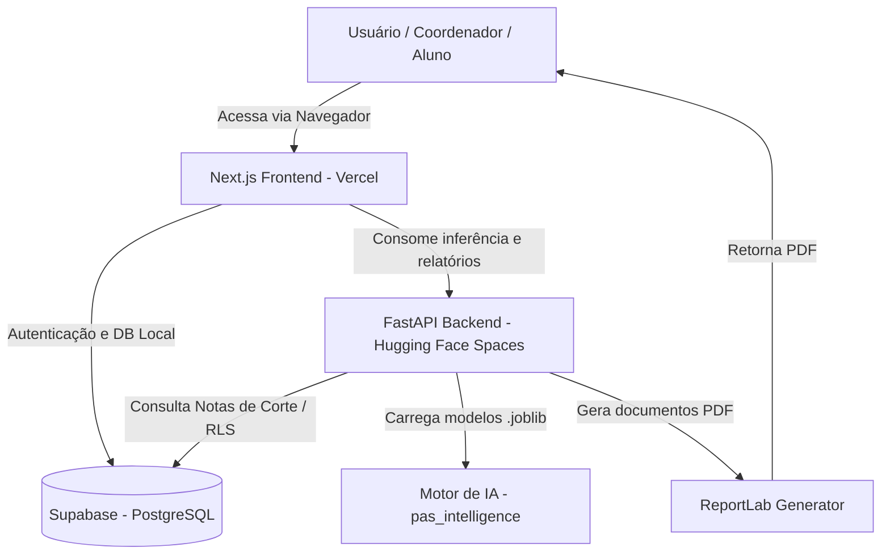

# Arquitetura e Stack Tecnológica

O **Vetor PAS** foi arquitetado com base em um conjunto de tecnologias modernas que oferecem robustez, alta escalabilidade e flexibilidade para o cliente final, operando em um ecossistema desacoplado de frontend e backend.

## Diagrama da Arquitetura

## Tecnologias Core

- **Next.js (React, TypeScript e TailwindCSS)**: Responsável pelo **Frontend** unificado (Landing page pública e painel autenticado do aluno e da escola). Hospedado na Vercel.
- **FastAPI (Python 3.10+)**: Camada de **Backend API** que serve as requisições de predição de notas, estatísticas de aprovação e geração de relatórios. Hospedado no Hugging Face Spaces.
- **Supabase**: Nosso "BaaS" (Backend as a Service). Atua como provedor de autenticação (OAuth, e-mail/senha) e banco de dados relacional (PostgreSQL) contendo dados de alunos e notas de corte históricas protegidos por Row Level Security (RLS).
- **Scikit-Learn e LightGBM**: Tecnologias que embasam o nosso *ensemble* dinâmico. Os modelos são serializados em arquivos `.joblib` e executados no backend FastAPI.
- **ReportLab**: Motor responsável por converter os dados calculados em artefatos físicos (PDFs whitelabel) gerados sob demanda e servidos pela API.
- **Streamlit (Legado/Admin)**: Utilizado para painéis rápidos de controle interno, análise e prototipação pedagógica rápida.

