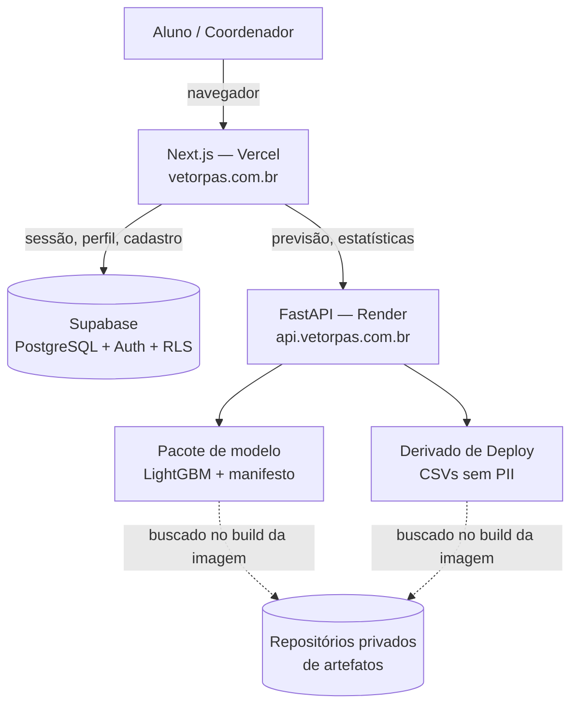

# Arquitetura

Visão técnica do sistema em produção. Para a leitura não técnica, veja
[Por que confiar](../confianca/de-onde-vem-os-dados.md).

## Camadas

**Frontend — Next.js (App Router, TypeScript, Tailwind)**, hospedado na Vercel em
`vetorpas.com.br`. Reúne o site institucional, as funcionalidades públicas e o portal autenticado.
Deploy automático a partir do Git.

**Backend — FastAPI (Python)**, em contêiner Docker no Render, em `api.vetorpas.com.br`. Serve as
previsões, o cálculo reverso e as séries históricas. **Não depende do Supabase**: lê o pacote de
modelo e os CSVs derivados que foram embarcados na imagem.

**Banco e autenticação — Supabase (PostgreSQL)**, consumido diretamente pelo frontend. Guarda
contas, perfis e cadastros, com isolamento por linha (RLS).

**Modelo — LightGBM**, distribuído como *pacote*: o arquivo do modelo em formato de texto nativo
mais um manifesto com a procedência. O pacote é a unidade versionada, nunca o arquivo solto —
modelo e metadados descasados carregam sem erro e respondem errado.

**Relatórios — ReportLab**, injetando dados em modelos de PDF whitelabel. Hoje consumido apenas
pela ferramenta interna; ainda não portado para a API.

## Distribuição de artefatos

Nem o modelo nem as bases entram no repositório de código. Eles vivem em repositórios privados de
artefatos e são buscados **no build da imagem**, nunca no boot do servidor.

Promover uma versão é mudar um ponteiro versionado; reverter é voltar esse ponteiro. O histórico
do Git vira o histórico de deploys, com autor e data.

A plataforma de hospedagem recebe um **repositório de deploy** dedicado — um retrato curado apenas
dos arquivos que a imagem precisa, gerado por script. O monorepo, com sua árvore e seu histórico,
nunca é enviado para hospedagem de terceiros.

## O que a API expõe

| Rota | O que faz |
|---|---|
| `POST /predict` | Previsão do Argumento Final e chance de aprovação |
| `POST /predict/strategy` | Cálculo reverso: quanto falta na última etapa |
| `GET /courses`, `/courses/chamadas`, `/courses/cutoff` | Cursos e notas de corte |
| `GET /temporal`, `/temporal/corte` | Séries históricas por ano |
| `POST /gestao/analyze` | Semáforo de risco de uma turma |
| `POST /escola/analyze` | Escola contra a população do triênio |
| `POST /comparacao` | Comparação estatística entre grupos |

## Desempenho e custo

O serviço roda em plano gratuito. Boot frio medido: **32,4 segundos** — comportamento normal desse
tipo de hospedagem, que acontece a cada deploy ou período ocioso, e não uma anomalia. O frontend
sabe esperar e avisa o usuário. Uso de memória em regime: 297 MB de 512 MB disponíveis.

## Ambiente

- `ENV=PROD` ou `ENV=DEV` (padrão `DEV`).
- Credenciais do Supabase em `.streamlit/secrets.toml` (fora do controle de versão) para a
  ferramenta interna; em `.env.local` para o frontend.
- A API não exige variáveis de ambiente para subir localmente — precisa apenas do pacote de modelo
  e dos CSVs derivados no disco.
